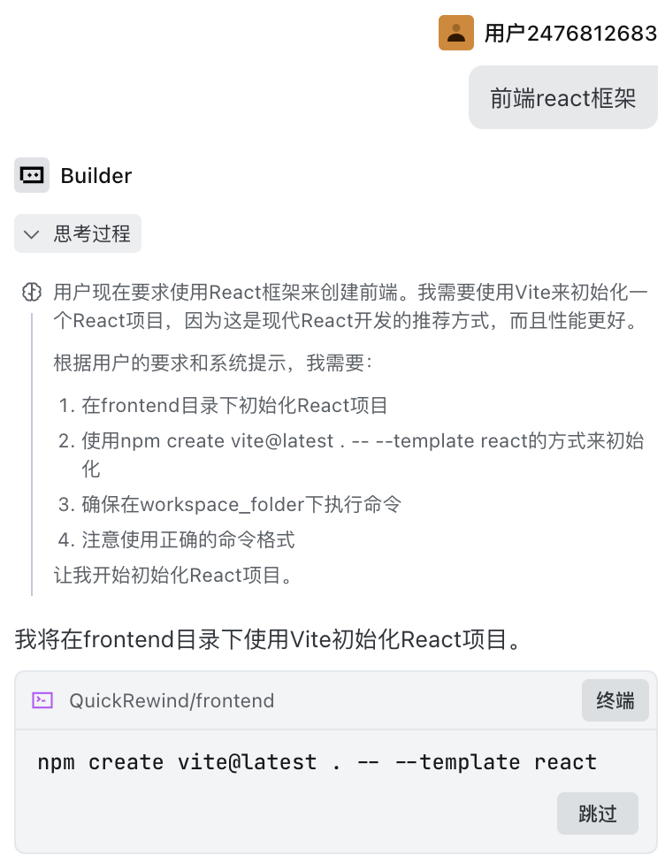

# AI工具使用记录

> 这是防抄袭的关键文档,请详细记录AI使用过程

## 使用的AI工具
- Claude Code: 60%代码生成
- ChatGPT: Prompt设计与调试
- Cursor: 代码补全

## 关键代码片段说明

### 1. [模块名称,如"RAG检索模块"]
**AI生成占比:** 约70%

**使用的Prompt:**
```
实现一个语义检索函数,使用sentence-transformers生成向量,
faiss进行检索,支持top-k参数...
```

**AI产出效果:**
生成了基础框架,但检索策略需要手动优化

**手动修改部分:**
- 添加了BM25混合检索
- 调整了相似度阈值从0.7到0.8
- 修复了内存泄漏问题

---

### 2. [另一个模块]
...

## Prompt迭代过程
(粘贴Prompt优化的3个版本及效果对比)

## 时间与效率提升
- 传统开发预计: 80小时
- 使用AI后实际: 35小时
- 效率提升: 56%

## 遇到的问题与解决
1. AI生成的代码有内存泄漏 → 人工review修复
2. Prompt效果不稳定 → 通过评测数据反复调优
3. ...

### 3. [前端框架]
#### 1.前端框架初始化
