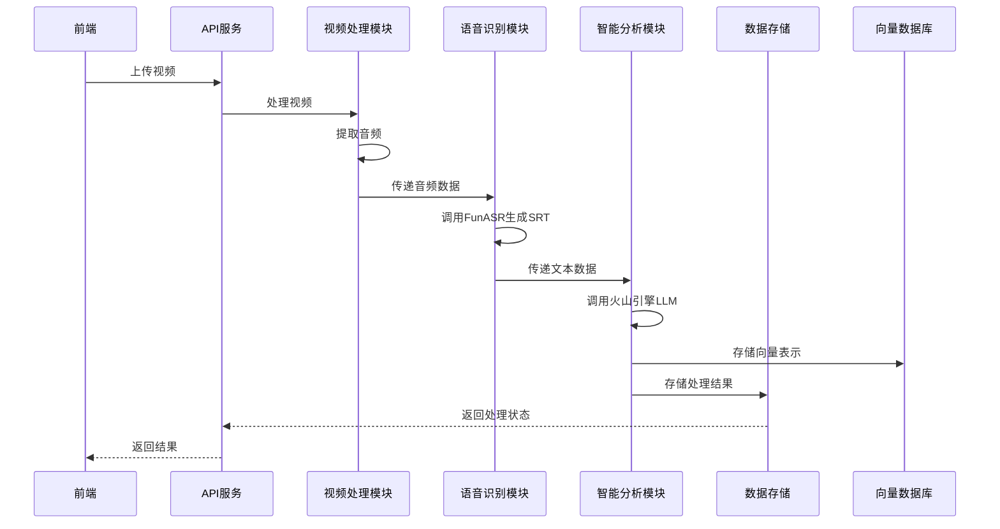

# QuickRewind 后端智能体技术方案

## 1. 项目概述

QuickRewind是一个视频AI智能体系统，能够处理视频内容，提取关键信息，并提供智能查询和摘要功能。本技术方案详细描述后端智能体的架构设计、技术选型和实现方案。

## 2. 技术栈选型

### 2.1 核心组件

| 组件类型 | 技术/框架 | 版本 | 选型理由 |
|---------|----------|------|--------|
| 编程语言 | Python | 3.9+ | 生态丰富，AI/ML库支持完善 |
| Web框架 | FastAPI | 0.104+ | 高性能，异步支持，自动API文档 |
| LLM服务 | 火山引擎 | - | 响应速度快，中文理解能力强 |
| 语音识别 | 阿里FunASR | 1.0+ | 开源高性能语音识别框架 |
| 向量数据库 | Milvus | 2.2+ | 高效的向量检索，已安装就绪 |
| 缓存 | Redis | 7.0+ | 会话管理和临时数据存储 |
| 数据库 | PostgreSQL | 14.0+ | 结构化数据持久化存储 |
| 容器化 | Docker | 20.10+ | 环境一致性和部署便捷性 |

## 3. 系统架构设计

### 3.1 整体架构

```
+----------------+      +------------------+      +------------------+
|                |      |                  |      |                  |
|    前端应用     | <---> |    后端API层     | <---> |    AI服务层      |
|                |      |                  |      |                  |
+----------------+      +------------------+      +------------------+
                               |                         |
                               v                         v
                       +------------------+      +------------------+
                       |                  |      |                  |
                       |    数据存储层     | <---> |    向量存储层     |
                       |                  |      |                  |
                       +------------------+      +------------------+
```

### 3.2 模块划分

1. **API服务模块**
   - 处理前端请求
   - 路由管理
   - 认证授权
   - 响应格式化

2. **视频处理模块**
   - 视频上传
   - 视频转码
   - 关键帧提取
   - 音频分离

3. **语音识别模块**
   - 调用阿里FunASR
   - 音频特征提取
   - SRT字幕生成
   - 文本后处理

4. **智能分析模块**
   - 调用火山引擎LLM
   - 内容理解
   - 摘要生成
   - 问答处理

5. **向量检索模块**
   - 文本向量化
   - Milvus集成
   - 相似内容检索
   - 语义搜索

6. **数据存储模块**
   - 用户数据管理
   - 视频元数据存储
   - 处理结果缓存
   - 历史记录管理

## 4. 核心功能实现

### 4.1 视频处理流程



### 4.2 LLM集成方案（火山引擎）

#### 4.2.1 环境配置

```python
# 火山引擎配置
VOLCENGINE_CONFIG = {
    "api_key": "YOUR_API_KEY",
    "secret_key": "YOUR_SECRET_KEY",
    "region": "cn-beijing",
    "model": "ERNIE-Bot-4",  # 或其他合适的模型
}
```

#### 4.2.2 调用方式

```python
import volcenginesdkcore
from volcenginesdkarkruntime import ArkRuntimeClient

class VolcLLM:
    def __init__(self, config):
        self.client = ArkRuntimeClient(
            volcenginesdkcore.AuthCredentials(
                access_key_id=config["api_key"],
                secret_access_key=config["secret_key"]
            )
        )
        self.model = config["model"]
    
    def generate(self, prompt, max_tokens=2048, temperature=0.7):
        response = self.client.chat_completions.create(
            model=self.model,
            messages=[{"role": "user", "content": prompt}],
            max_tokens=max_tokens,
            temperature=temperature
        )
        return response.choices[0].message.content
```

### 4.3 语音识别集成（阿里FunASR）

#### 4.3.1 环境配置

```bash
# 安装依赖
pip install funasr==1.0.4
pip install modelscope
```

#### 4.3.2 实现方案

```python
from funasr import AutoModel

class SpeechRecognizer:
    def __init__(self):
        # 加载中文语音识别模型
        self.model = AutoModel(model="damo/speech_paraformer-large_asr_nat-zh-cn-16k-common-vocab8404-pytorch", 
                               model_revision="v2.0.4")
    
    def transcribe(self, audio_path):
        # 执行语音识别
        result = self.model.generate(input=audio_path, 
                                     batch_size_s=300, 
                                     output_dir=None)
        
        # 处理结果并生成SRT格式
        srt_content = self._generate_srt(result)
        return srt_content
    
    def _generate_srt(self, recognition_result):
        # 将识别结果转换为SRT格式
        srt_lines = []
        index = 1
        
        for segment in recognition_result:
            start_time = segment["start"]
            end_time = segment["end"]
            text = segment["text"]
            
            # 格式化时间戳
            start_str = self._format_time(start_time)
            end_str = self._format_time(end_time)
            
            srt_lines.append(f"{index}")
            srt_lines.append(f"{start_str} --> {end_str}")
            srt_lines.append(text)
            srt_lines.append("")
            index += 1
        
        return "\n".join(srt_lines)
    
    def _format_time(self, seconds):
        # 将秒转换为SRT时间格式
        hours = int(seconds / 3600)
        minutes = int((seconds % 3600) / 60)
        secs = int(seconds % 60)
        millis = int((seconds - int(seconds)) * 1000)
        return f"{hours:02d}:{minutes:02d}:{secs:02d},{millis:03d}"
```

### 4.4 Milvus向量数据库集成

#### 4.4.1 环境配置

```python
# Milvus配置
MILVUS_CONFIG = {
    "host": "localhost",
    "port": 19530,
    "collection_name": "video_content_vectors",
    "dim": 768,  # 向量维度，根据使用的嵌入模型调整
}
```

#### 4.4.2 实现方案

```python
from pymilvus import connections, FieldSchema, CollectionSchema, DataType, Collection, utility

class MilvusVectorStore:
    def __init__(self, config):
        self.config = config
        self._connect()
        self._create_collection_if_not_exists()
    
    def _connect(self):
        # 连接到Milvus服务
        connections.connect(
            host=self.config["host"],
            port=self.config["port"]
        )
    
    def _create_collection_if_not_exists(self):
        # 创建集合（如果不存在）
        if not utility.has_collection(self.config["collection_name"]):
            fields = [
                FieldSchema(name="id", dtype=DataType.INT64, is_primary=True, auto_id=True),
                FieldSchema(name="video_id", dtype=DataType.VARCHAR, max_length=64),
                FieldSchema(name="timestamp", dtype=DataType.FLOAT),
                FieldSchema(name="content", dtype=DataType.VARCHAR, max_length=512),
                FieldSchema(name="vector", dtype=DataType.FLOAT_VECTOR, dim=self.config["dim"]),
            ]
            
            schema = CollectionSchema(fields, "Video content vectors")
            self.collection = Collection(
                name=self.config["collection_name"],
                schema=schema
            )
            
            # 创建索引
            index_params = {
                "index_type": "IVF_FLAT",
                "metric_type": "L2",
                "params": {"nlist": 128}
            }
            self.collection.create_index(field_name="vector", index_params=index_params)
        else:
            self.collection = Collection(self.config["collection_name"])
    
    def insert(self, video_id, timestamp, content, vector):
        # 插入向量数据
        entities = [
            [video_id],
            [timestamp],
            [content],
            [vector]
        ]
        self.collection.insert(entities)
        self.collection.flush()
    
    def search(self, query_vector, top_k=5):
        # 搜索相似向量
        self.collection.load()
        search_params = {
            "metric_type": "L2",
            "params": {"nprobe": 10}
        }
        
        results = self.collection.search(
            data=[query_vector],
            anns_field="vector",
            param=search_params,
            limit=top_k,
            output_fields=["video_id", "timestamp", "content"]
        )
        
        return results[0]
```

## 5. API设计

### 5.1 视频处理API

| API路径 | 方法 | 功能描述 | 请求体 | 成功响应 |
|---------|------|----------|--------|----------|
| `/api/videos` | POST | 上传视频 | `multipart/form-data` | `{"video_id": "...", "status": "processing"}` |
| `/api/videos/{video_id}` | GET | 获取视频状态 | N/A | `{"video_id": "...", "status": "completed", "results": {...}}` |
| `/api/videos/{video_id}/transcript` | GET | 获取视频字幕 | N/A | SRT格式文本 |

### 5.2 智能分析API

| API路径 | 方法 | 功能描述 | 请求体 | 成功响应 |
|---------|------|----------|--------|----------|
| `/api/videos/{video_id}/summary` | GET | 获取视频摘要 | N/A | `{"summary": "..."}` |
| `/api/videos/{video_id}/qa` | POST | 视频内容问答 | `{"question": "..."}` | `{"answer": "..."}` |
| `/api/search` | POST | 语义搜索 | `{"query": "...", "top_k": 5}` | `[{"video_id": "...", "content": "...", "score": 0.95}]` |

## 6. 数据流程

### 6.1 视频处理主流程

1. 接收视频上传请求
2. 保存视频文件到临时存储
3. 异步启动视频处理任务
4. 提取音频轨道
5. 使用FunASR进行语音识别
6. 生成SRT字幕文件
7. 将文本内容传递给LLM进行理解
8. 向量化处理后的文本内容
9. 存储向量数据到Milvus
10. 保存处理结果到数据库
11. 更新任务状态为完成

### 6.2 智能查询流程

1. 接收用户查询请求
2. 使用LLM理解查询意图
3. 将查询转换为向量表示
4. 在Milvus中搜索相似向量
5. 获取相关视频片段信息
6. 调用LLM生成回答
7. 返回结果给用户

## 7. 部署与扩展

### 7.1 Docker部署

```dockerfile
# Dockerfile
FROM python:3.9-slim

WORKDIR /app

COPY requirements.txt .
RUN pip install --no-cache-dir -r requirements.txt

COPY . .

EXPOSE 8000

CMD ["uvicorn", "app.main:app", "--host", "0.0.0.0", "--port", "8000"]
```

### 7.2 环境变量

| 环境变量 | 描述 | 默认值 |
|---------|------|--------|
| `VOLCENGINE_API_KEY` | 火山引擎API Key | - |
| `VOLCENGINE_SECRET_KEY` | 火山引擎Secret Key | - |
| `MILVUS_HOST` | Milvus主机地址 | localhost |
| `MILVUS_PORT` | Milvus端口 | 19530 |
| `REDIS_URL` | Redis连接URL | redis://localhost:6379 |
| `POSTGRES_URL` | PostgreSQL连接URL | - |
| `WORKERS` | 工作进程数 | 4 |

## 8. 性能优化

1. **异步处理**：使用FastAPI的异步特性和Celery任务队列处理耗时操作
2. **缓存策略**：使用Redis缓存热点数据和会话信息
3. **批量处理**：音频处理和向量插入采用批量方式提升性能
4. **模型优化**：使用ONNX加速模型推理，考虑使用量化技术减少内存占用
5. **数据库优化**：为PostgreSQL添加合适的索引，优化查询性能
6. **Milvus优化**：根据数据规模调整索引参数和查询参数

## 9. 安全性考虑

1. **API认证**：实现基于JWT的身份验证机制
2. **输入验证**：严格验证所有用户输入，防止注入攻击
3. **文件上传安全**：限制上传文件类型和大小，扫描恶意文件
4. **敏感信息保护**：环境变量管理API密钥，不在代码中硬编码
5. **CORS配置**：合理配置跨域资源共享策略
6. **日志审计**：记录关键操作日志，便于安全审计

## 10. 后续优化方向

1. **模型微调**：根据业务场景对语音识别和LLM模型进行微调
2. **多模态支持**：增加图像理解能力，实现多模态内容分析
3. **实时处理**：优化处理流程，支持准实时视频分析
4. **分布式部署**：支持水平扩展，应对高并发场景
5. **监控告警**：完善监控体系，及时发现和处理异常
6. **用户反馈机制**：收集用户反馈，持续优化系统性能和准确性

---

本技术方案提供了QuickRewind后端智能体的完整设计，涵盖了火山引擎LLM、阿里FunASR和Milvus向量数据库的集成方案。方案具有良好的可扩展性和可维护性，能够满足视频内容智能分析和查询的需求。